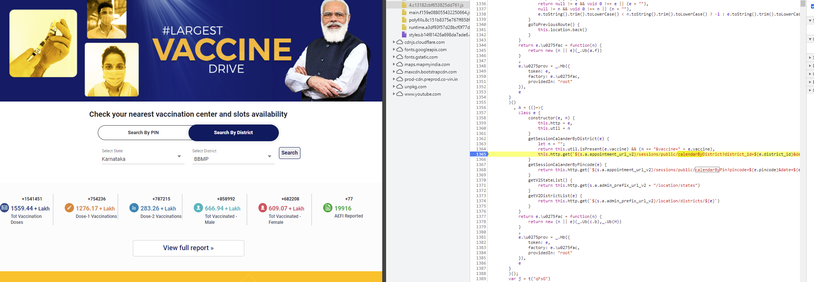

# vaxalert


## How to use this
I hope you have a bash shell handy.

1. Clone the repo
```bash
git clone https://github.com/shashankmahajan/vaxalert
```
2. Fire up a new virtual env and activate it
```bash
python3 -m venv vaxalert_env
source vaxalert_env/bin/activate
```

3. Install the deps
```bash
pip install -r requirements.txt
```

4. Open up a new bash shell to set the alert job to run in.

5. Set the telegram bot token and the chat Id to post the messages to...
```bash
export TELERGAM_BOT_TOKEN=<your-bot-token>
export TELEGRAM_BOT_CHAT_ID=<your-group-chat_id>
```

6. Run the `vaxalert.py` script
```bash
chmod +x src/vaxalert/vaxalert.py
python3 -u vaxalert.py
```

* If you want to change the polling frequency, update in `vaxalert.py` at line. Needs to be consistent with syntax of the `schedule` package.
```python
@repeat(every(5).minutes)
```
* The only change needed to script to suit your district is at lines
```python
messages = generate_available_appointments_message(
        294,  # BBMP
        ['560066', '560048', '560035', '560103', '560017'], # PIN Codes of your interest
        5,
        [18, 45] # Age filters, feel free to drop 45 if not looking for parents etc.
    )
```
'294' is the `district_id` for BBMP Bengaluru. I found it using a bit of JS debugging on the COWIN page. Place breakpoint as in the image below:


Set the pin codes where feasible for you to get shot!

Set the age filters, quite trivial.

* Setting up telegram bot to post updates to Telegram group chats:
I did from scratch, found this useful -> [How to create a Telegram bot, and send messages with Python](https://medium.com/@ManHay_Hong/how-to-create-a-telegram-bot-and-send-messages-with-python-4cf314d9fa3e)

This step will yield you a auth token for the Telegram bot as well as the group chat ID, both of which are needed for this script to work. Set them as in step (5) above.

Let me know if clarification is needed on some step.

* Thanks to [Giri](https://github.com/iev6) who pointed out how to deploy this using the [Replit](https://replit.com/~) web application. You can simply fork this repo, make your necessary code changes, deploy on Replit by connecting it to your forked repo! Its reasonably intuitive to use.


## Stay safe! Get shot! May be antibodies be with you!